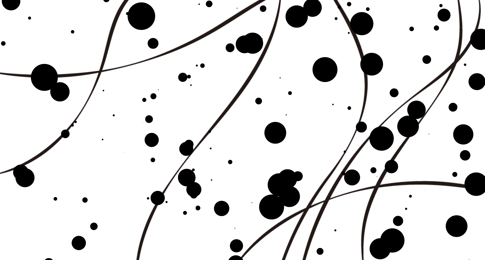

## Civilization Loop

#### Theme
The the process that human beings get civilized is a loop.

At first, in the primitive ancient time, everyone's ignorant. As the time passing by, people gradually learn something from trials and errors, and get more and more knowledgable. However, the development won't last forever. Everything dies after sometime, and all the civilization goes back to zero. And then a new different loop starts all over again.

#### Interaction
Using sound as a input parameter, Civilization Loop is a real-time interactive graphic p5.js project. The sound made by the audience is a metaphor of "human activities", from which new knowledge is learned. The volume affects the output graphic result, and there are no two loops exactly the same, after all, the civilization process is unpredictable.

