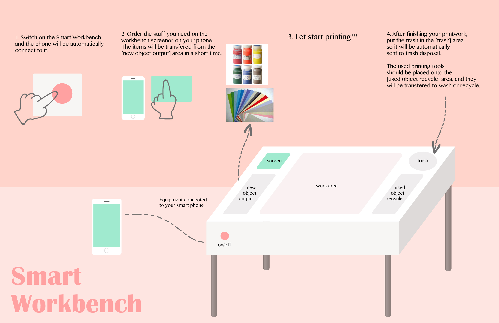

# Smart Workbench

I used to do a lot of printmaking practices, especially lino and silkscreen printing.
The preparation before printing together with the clean-up process after that are always exhausting and time-consuming. So I designed the Smart Workbench to simplify those two steps.

### Traditional Process
##### Preparation
* Buy paint
* Buy printing tools (silkscreen/lino, paper, apron, etc)

##### Printmaking
* Put the graphic onto the silkscreen or lino and print!

##### Clean-up
* take away your printmaking masterpiece and reserve them well. (auto scan and save as photo copy as well as the paperwork themselves)
* Clean up the tools, apron, etc
* Throw away the trash

### How Does Smart Workbench Help

##### Earlier drafts (discarded)

